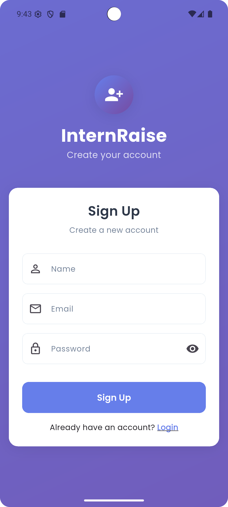
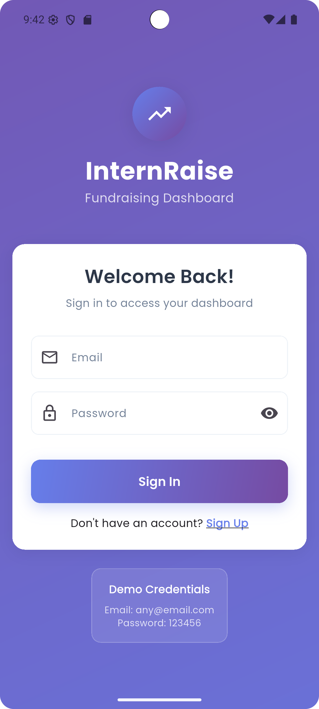
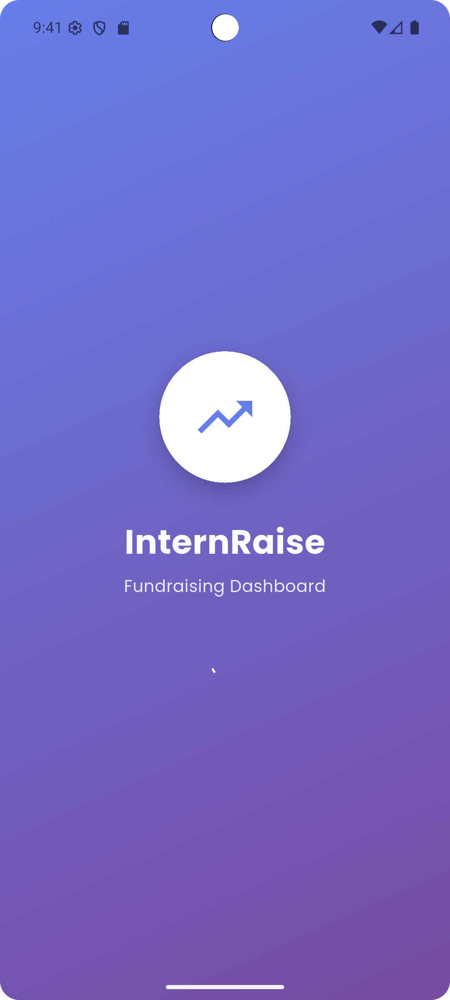
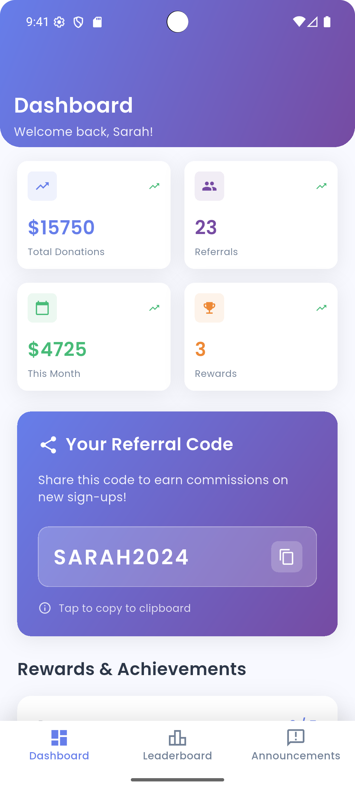
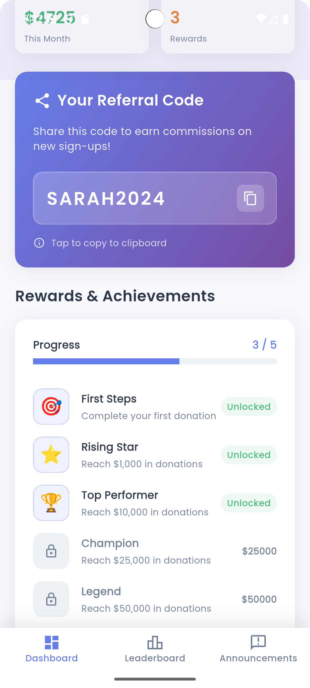
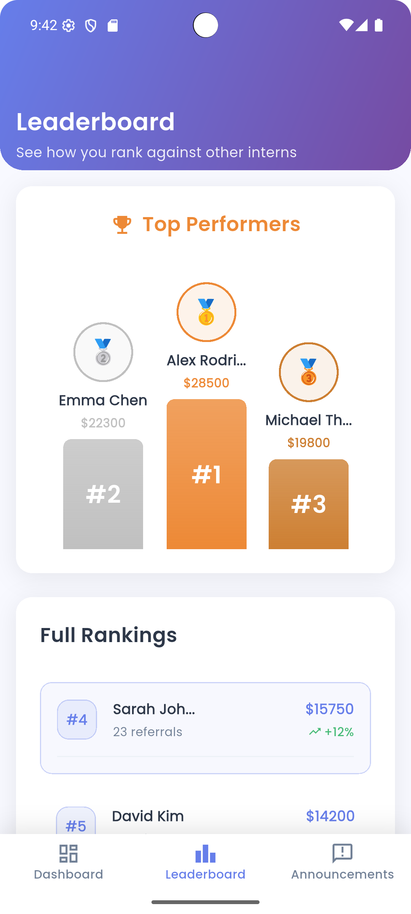
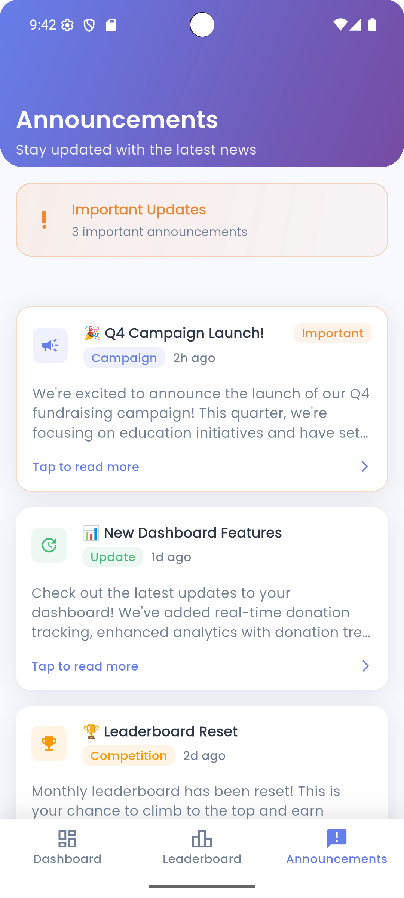

# InternRaise - Fundraising Intern Dashboard

A modern Flutter app for fundraising interns to track donations, view leaderboards, and stay updated with announcements.

## 🚀 Quick Start

1. **Clone the repository**
   ```bash
   git clone <repository-url>
   cd fundraising_intern_portal
   ```
2. **Install dependencies**
   ```bash
   flutter pub get
   ```
3. **Run the app**
   ```bash
   flutter run
   ```

## 🛠️ Installation

1. **Install Flutter & Dart:**
   - Download and install Flutter SDK (3.0+): https://docs.flutter.dev/get-started/install
   - Dart is included with Flutter.
   - Add Flutter to your system PATH.

2. **Check your environment:**
   - Open a terminal and run:
     ```bash
     flutter doctor
     ```
   - Follow any instructions to resolve issues (e.g., install Android Studio, Xcode, or required dependencies).

3. **Set up an emulator or device:**
   - For Android: Use Android Studio AVD Manager to create an emulator, or connect a physical device with USB debugging enabled.
   - For iOS: Use Xcode Simulator or connect an iPhone (macOS only).

4. **Get project dependencies:**
   - In your project directory, run:
     ```bash
     flutter pub get
     ```

5. **Run the app:**
   - Start your emulator or connect your device.
   - Run:
     ```bash
     flutter run
     ```

6. **(Optional) Build for release:**
   - Android APK:
     ```bash
     flutter build apk --release
     ```
   - iOS (macOS only):
     ```bash
     flutter build ios --release
     ```

## 📂 Project Structure

```
fundraising_intern_portal/
├── Images/                # App screenshots and assets
├── android/               # Android native files
├── ios/                   # iOS native files
├── lib/                   # Main Dart codebase
│   ├── bloc/              # BLoC state management
│   ├── models/            # Data models
│   ├── screens/           # UI screens
│   ├── services/          # Data and API services
│   ├── theme/             # App theming
│   ├── widgets/           # Reusable widgets
│   └── main.dart          # App entry point
├── pubspec.yaml           # Flutter dependencies
├── README.md              # Project documentation
└── ...                    # Other config and platform files
```

## 🖼️ Screenshots

Below are sample screens from the app:

<table>
  <tr>
   <td></td>
   <td></td>
   <td></td>

  </tr>
  <tr>
    <td></td>
    <td></td>
    <td></td>
  </tr>
  <tr>
     <td></td>
    <td></td>
  </tr>
</table>


## 📞 Support

- Create an issue in the repository
- Contact the development team

---

**Built with Flutter & BLoC**
